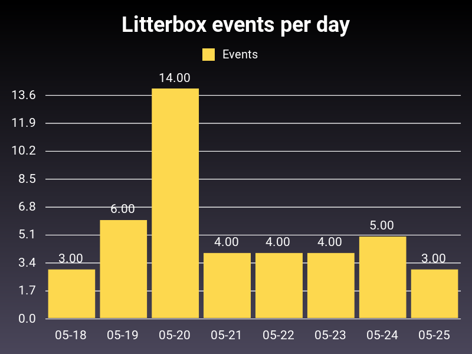

This app is used for visualizing litterbox usage based on HomeAssistant sensor data.

I use it with the LitterRobot 3, but it should work with any litterbox that rotates.

I installed an Akara sensor on the LitterRobot, set up the sensor in HomeAssistant, and use the HomeAssistant integration to get the data.

Run either with docker-compose by `docker-compose up --build`, or
with docker by `docker build -t litterbox .` and `docker run -v (hdata_path):/hadata -v $(pwd)/output:/output litterbox`.

You can see the example output in the example_data.png file:

